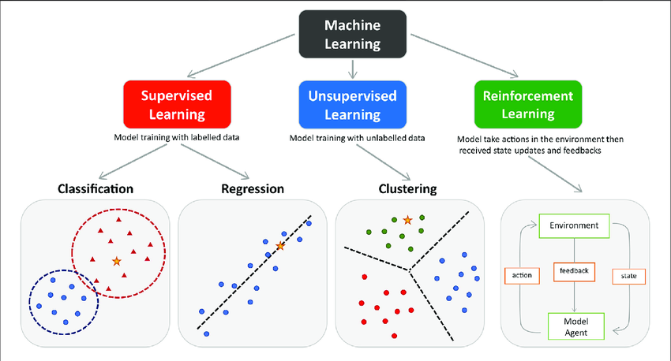
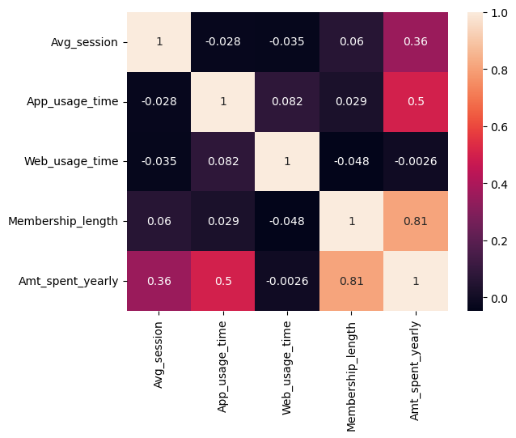
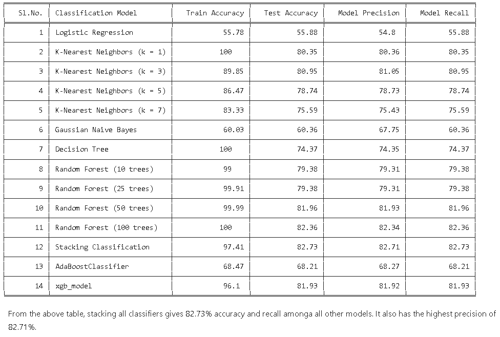

# ML_projects

This repository is about explaining each Machine Learning concepts which I have learnt from "5C16 Deep learning and its applications" module from Trinity College Dublin

The repository has the projects of Machine learning and the models are imported from `scikit-learn` library.

Also, it contains uses of Exploratory Data Analysis, Hypothesis testing, Chi-square test.

---

## Installation

* To use the jupyter notebook, please download all the github files or fork the files.
* The required libraries are in the `requirements.txt` file.
* To run the code, please install all the libraries by using the code `conda install --file requirements.txt` in conda or ` pip install -r requirements. txt` in your machine.

---
## Projects
### ***1. Supervised learning***

Supervised learning is a type of machine learning where the algorithm learns from labeled data. In supervised learning, the algorithm is provided with a dataset consisting of input-output pairs. The goal is to learn a mapping from inputs to outputs so that, given new, unseen data, the algorithm can predict the correct output.

* `1_linear_regression.ipynb` - This jupyter notebook consits of applying linear regression to ecommerce users data. The target of this project is to predict the amount spent by the customer by understanding the features of the data. 

    By doing the exploratory data analysis, this gives the marketting team and the company to know where to invest the money and what to market to increase the amount spent by user. 

    The Mean Absolute Error(MAE) of 8 units is achieved and the assumption of residuals are normally distributed is proved.

    <!--  -->
    

* `2_Classification.ipynb` - This notebook consisits of building an inteeligence system to classify people intoe credit score by using statistics and machine learning concepts.

    * The data is cleaned as the raw data has outliers, missing values and filled with special characters.

    * The feature analysis is performed to check the `dependency of categorical and numerical variables on the credit score`.

    * The statisitical tests such as `Chi-square, Shapiro-Wilk test, Kruskal - Wallis test` to check the dependency, normal distributon and to test dependency when it is not distributed normally.

    * The `log transformation` is applied to reduce skewness of numerical data, concepts of `one-hot encoding` and `oridnal encdoing ` is applied to encode the features for categorical variable.

    * Various classifers such as `Logistic Regression, K-nn, Guassian NB, Decision trees, Random forest, Stacking classifier, AdaBoost, XGBoost` are applied.

    * Table of model evaluation is shown and the Stacking classifier is with highest accuracy of 82.73%

    <!--  -->
    

<!-- ---
### ***2. Unsupervised learning***
Will be updated shortly -->

## Results

The results are clearly explained at the end of Jupyter Notebook. Please refer to `scikit-learn` library for more information about algorithms and packages.

---
## Credits

These notebooks are created for anyone  who wishes to learn about statistics the way I learnt. Also, I would like to give credits to

* `Probability & Statistics for Machine Learning & Data Science` course by deeplearning.ai
* `5C16 Deep learning and its applications` by **François Pitié**